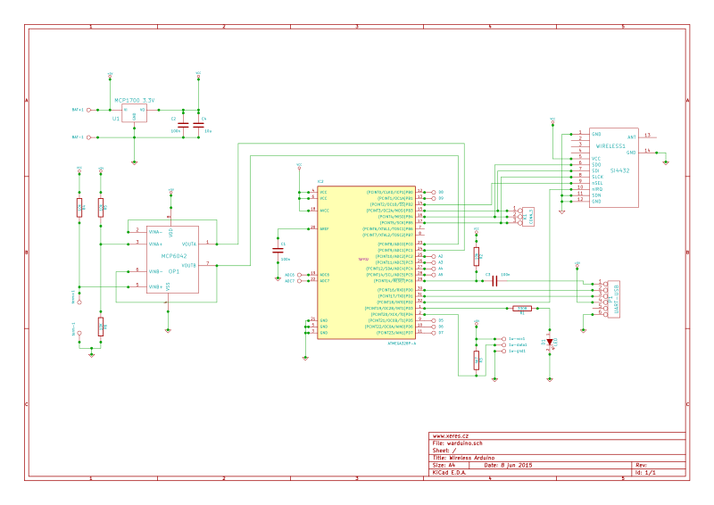
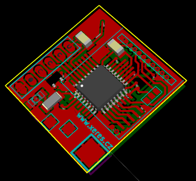
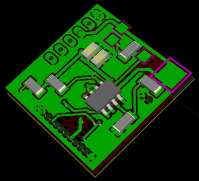
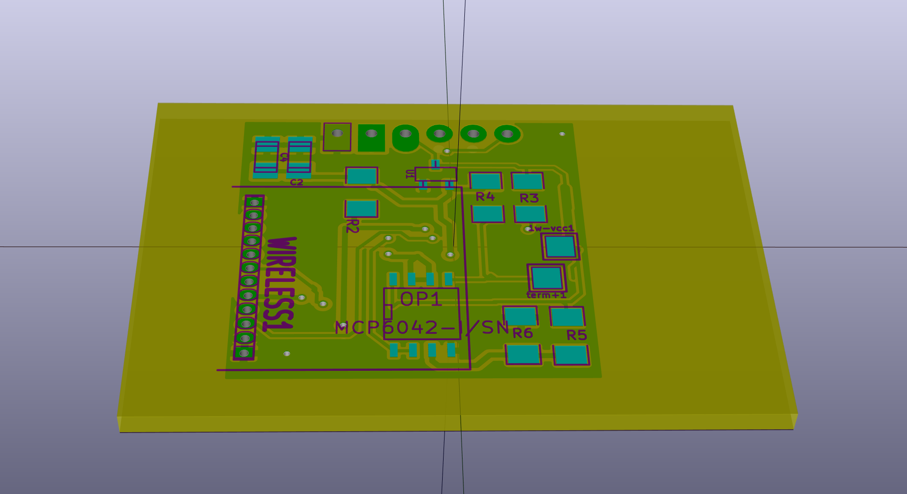

Warduxere
===========================================
Wireless Arduino with low power consumption

Warduxere (old name was Warduino) was awarded the prize in a magazine for the design of electronic journals [PE-AR](http://www.aradio.cz/). 
### About ###
This project is open-source alternative for other proprietary platform.

It is base on Arduino - CPU AVR ATmega328.
This device is designed for wireless comunication and long run on battery.

### Using 
directories contain
- arduino - example program for arduino - wiring language
- pcb - scheme in Kicad and pcb

## Scheme

## 3D view of device
First model from year 2014.

warduxere DPS v2

[warduxere documentation](https://blog.josefjebavy.cz/warduxere)
